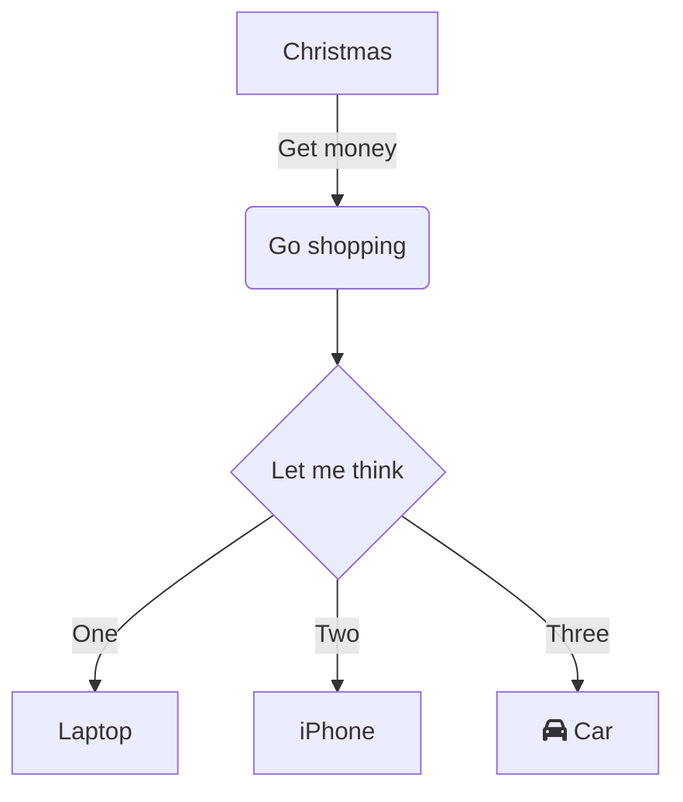

 

 

<!--MERMAID {width:100}-->

<!--MCONTENT {content: "graph TD \nA\\[Christmas\\] \\-\\-\\>|Get money| B(Go shopping) \nB \\-\\-\\> C{Let me think} \nC \\-\\-\\>|One| D\\[Laptop\\] \nC \\-\\-\\>|Two| E\\[iPhone\\] \nC \\-\\-\\>|Three| F\\[fa:fa-car Car\\] "} --->

 

 

 

This file was generated by Swimm. [Click here to view it in the app](https://app.swimm.io/repos/Z2l0aHViJTNBJTNBZG9jdXNhdXJ1cyUzQSUzQUppcm9z/docs/gcluz).
